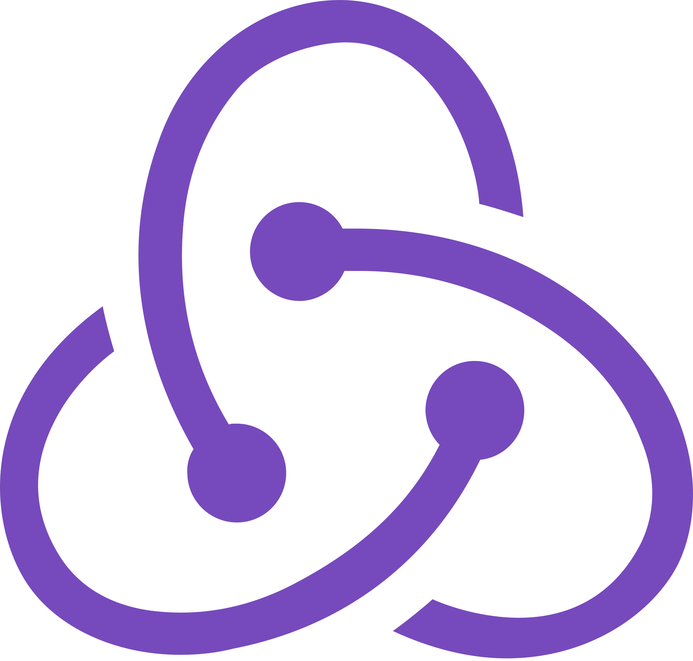
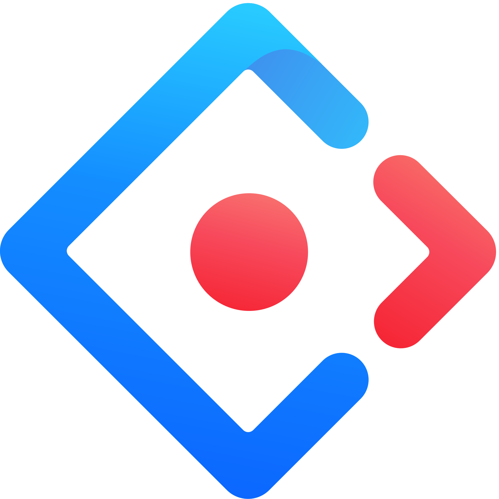
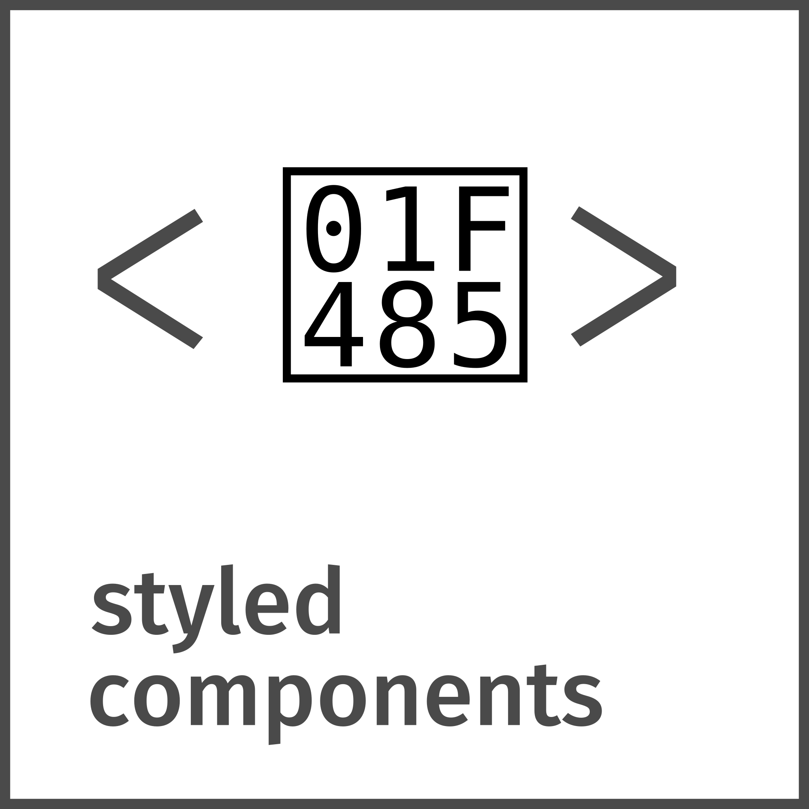
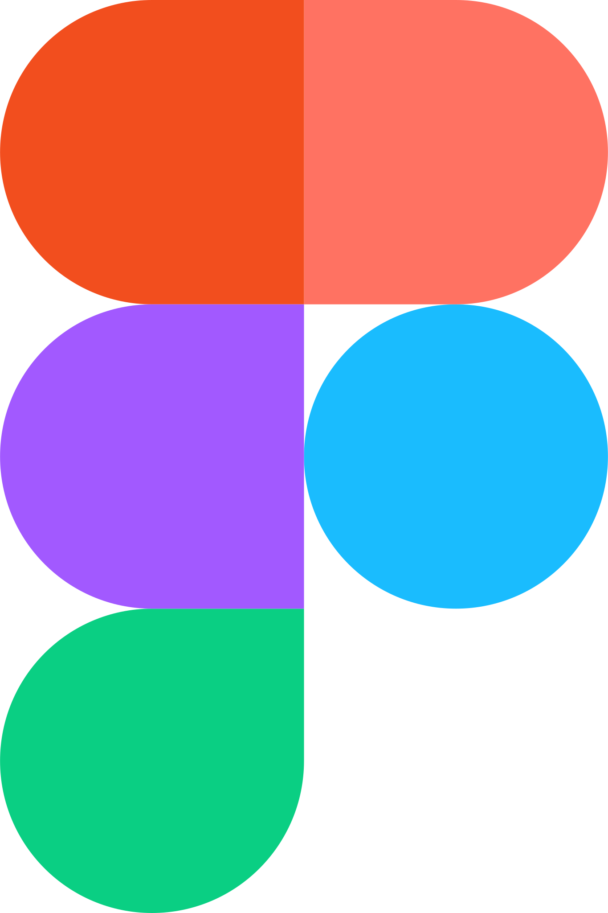
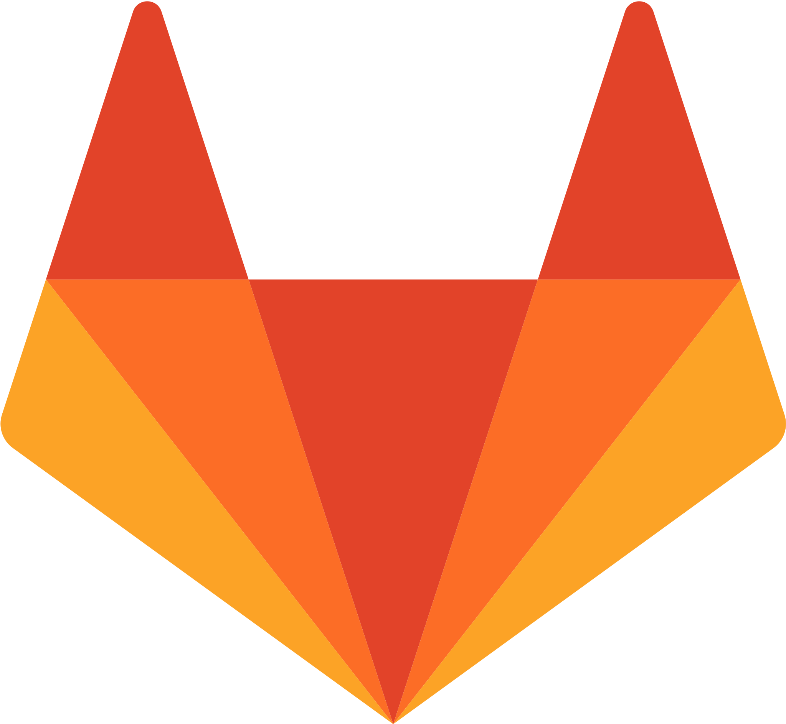

<!-- Say hello -->

    <a href="https://git.io/typing-svg">
        
    </a>

 
 

    I build web applications — and I keep them running. I started on the frontend: an e-commerce store, a learning management system, then real-time trading apps used by traders at 10+ securities firms. Along the way I got curious about what happens after the build — how code gets packaged, deployed, and monitored. That curiosity became my current role.    Today I work in DevOps Engineer, deploying and operating internal platforms on Kubernetes and researching the centralized building blocks — identity, API gateway, caching, observability — that our teams reuse.     What ties it together: I like owning a product from the first requirements conversation to the last deployment.

<!-- Tech stack -->
<h2>Tech stack</h2>

    <b>Languages</b>
     
     
    <a href="https://developer.mozilla.org/en-US/docs/Web/JavaScript" target="_blank">
        <code></code>
    </a>
    <a href="https://typescriptlang.org" target="_blank">
        <code></code>
    </a>

 
 

    <b>Frontend</b>
     
     
    <a href="https://developer.mozilla.org/en-US/docs/Web/HTML" target="_blank">
        <code></code>
    </a>
    <a href="https://developer.mozilla.org/en-US/docs/Web/CSS" target="_blank">
        <code></code>
    </a>
    <a href="https://react.dev/" target="_blank">
        <code></code>
    </a>
    <a href="https://nextjs.org/" target="_blank">
        <code></code>
    </a>
    <a href="https://reactnative.dev/" target="_blank">
        <code></code>
    </a>
    <a href="https://tanstack.com/" target="_blank">
        <code></code>
    </a>
    <a href="https://redux.js.org/" target="_blank">
        <code></code>
    </a>
     
     
    <a href="https://mui.com/material-ui/" target="_blank">
        <code></code>
    </a>
    <a href="https://ant.design/" target="_blank">
        <code></code>
    </a>
    <a href="https://getbootstrap.com/" target="_blank">
        <code></code>
    </a>
    <a href="https://sass-lang.com/" target="_blank">
        <code></code>
    </a>
    <a href="https://styled-components.com/" target="_blank">
        <code></code>
    </a>

 
 

    <b>Backend</b>
     
     
    <a href="https://nestjs.com" target="_blank">
        <code></code>
    </a>

 
 

    <b>Databases</b>
     
     
    <a href="https://www.wikiwand.com/en/Microsoft_SQL_Server" target="_blank">
        <code></code>
    </a>
    <a href="https://dbeaver.io/" target="_blank">
        <code></code>
    </a>
    <a href="https://redis.io/" target="_blank">
        <code></code>
    </a>

 
 

    <b>DevOps</b>
     
     
    <a href="https://docker.com" target="_blank">
        <code></code>
    </a>
    <a href="https://kubernetes.io" target="_blank">
        <code></code>
    </a>

 
 

    <b>Tools</b>
     
     
    <a href="https://code.visualstudio.com/" target="_blank">
        <code></code>
    </a>
    <a href="https://www.postman.com/" target="_blank">
        <code></code>
    </a>
    <a href="https://www.atlassian.com/software/jira" target="_blank">
        <code></code>
    </a>
    <a href="https://www.figma.com/" target="_blank">
        <code></code>
    </a>

 
 

    <b>Source Control</b>
     
     
    <a href="https://git-scm.com/" target="_blank">
        <code></code>
    </a>
    <a href="https://github.com/" target="_blank">
        <code></code>
    </a>
    <a href="https://about.gitlab.com/" target="_blank">
        <code></code>
    </a>

 
 
